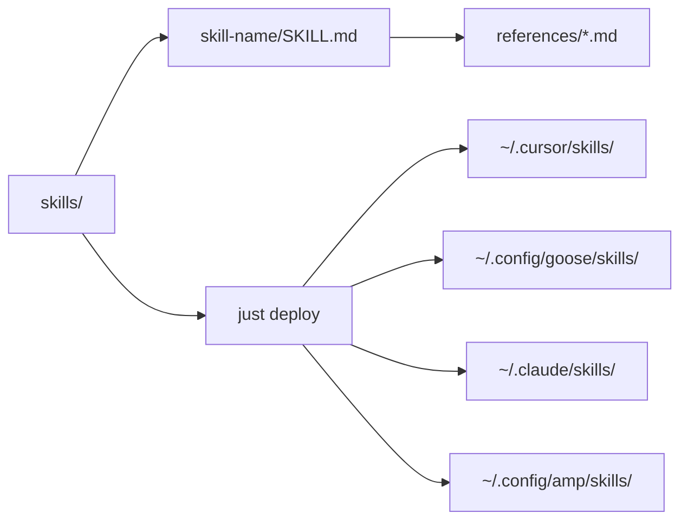

# AI Agent Instructions

## Project Context

This is a centralized skills library for AI coding agents (Cursor, Goose, Claude Code, and Amp). It contains 28 skills covering coding standards, workflows, and conventions harvested from 30+ projects.

- **Primary language**: Markdown (SKILL.md files)
- **Task runner**: just
- **Deployment**: Symlinks to `~/.cursor/skills/`, `~/.config/goose/skills/`, `~/.claude/skills/`, `~/.config/amp/skills/`

## Commands

Use the `justfile` for all standard operations:

```bash
just deploy          # Deploy all skills via symlinks to all agent platforms
just list            # List all available skills with descriptions
just validate        # Validate all SKILL.md files have required frontmatter
just sync            # Pull latest from git and redeploy
just install-sync    # Install daily launchd job to auto-sync (macOS)
just uninstall-sync  # Remove the daily sync job
```

## Architecture



Each skill lives in `skills/{skill-name}/` containing a required `SKILL.md` with YAML frontmatter (`name`, `description`) and optional `references/` directory for supplementary docs.

## Skills

Development guidance lives in `skills/`. Read the relevant SKILL.md before starting a task.

| Category | Skills |
|----------|--------|
| Python | `python-project-structure`, `python-coding-style`, `python-api-structure`, `python-precommit-setup`, `python-debugging` |
| Other Languages | `go-coding-style`, `typescript-coding-style`, `elixir-coding-style`, `terraform-coding-style`, `shell-coding-style`, `bash-cross-platform`, `shell-project-architecture`, `frontend-design` |
| Cross-Language | `linting-standards`, `testing-standards`, `ci-cd-patterns`, `cross-language-comments`, `documentation-standards`, `terraform-project-structure` |
| Git | `git-conventions`, `git-branching`, `git-pull-requests`, `project-templates` |
| Documentation | `readme-blueprint-generator` |
| Agent Behavior | `agent-workflow`, `self-improvement`, `subagent-patterns`, `skill-creator`, `code-review` |
| MCP | `mcp-server` |

## Common Tasks

### Adding a New Skill

1. Create `skills/{skill-name}/SKILL.md` with required frontmatter:
   ```yaml
   ---
   name: skill-name
   description: What it does and when to use it.
   ---
   ```
2. Optionally add `references/` for supplementary docs
3. Run `just validate` to check frontmatter
4. Run `just deploy` to install
5. Run `just list` to verify

### Editing an Existing Skill

1. Read the current SKILL.md before making changes
2. Keep SKILL.md under 500 lines; extract large content into `references/`
3. Run `just validate` after changes
4. Run `just deploy` to update symlinks

### Checking for Cross-Skill Conflicts

When modifying a skill, check that it doesn't contradict related skills. Common conflict areas:
- Type checker (basedpyright, not mypy)
- Linter (ruff, not pylint)
- justfile commands (always use `uv run` prefix for Python)
- Quality gate order (format -> lint -> typecheck -> test)
- Section dividers (compact `# === Name ===` format)

## Code Conventions

### SKILL.md Files

- **Frontmatter**: `name` and `description` are required; `argument-hint` is optional
- **Description**: Acts as the primary trigger mechanism -- make it slightly "pushy" to combat undertriggering
- **Writing style**: Explain *why* over mandating with ALL-CAPS directives; firm language is fine for hard constraints (security, data loss) when paired with reasoning
- **Progressive disclosure**: Metadata always loaded -> SKILL.md body on trigger -> references/ on demand
- **Verification checklist**: End each skill with a checklist of key requirements

### Markdown Standards

- Code blocks always specify language (` ```bash `, ` ```yaml `, ` ```python `, etc.)
- Tables properly formatted with header row and alignment
- One H1 per file, H2 for major sections, H3 for subsections
- Use Mermaid diagrams for architecture and data flow -- not ASCII art

### Git Conventions

- **Commits**: Conventional commits (`type(scope): description`) -- lowercase imperative, no period
- **Branching**: Trunk-based development with short-lived feature branches (`feat/`, `fix/`, `docs/`, `chore/`)
- **PRs**: Title follows conventional commit format; include summary, changes, and test plan

## Files to Avoid Modifying

- `uv.lock` -- Lock files
- Symlinked directories under `~/.cursor/skills/`, `~/.config/goose/skills/`, etc. -- managed by `just deploy`

## Landing the Plane (Session Completion)

When ending a work session, complete all steps:

1. **File issues** for any remaining or follow-up work
2. **Run quality gates**: `just validate`
3. **Commit** with conventional commit format (`type(scope): description`)
4. **Offer to push** to remote:
   ```bash
   git push
   git status  # Should show "up to date with origin"
   ```
5. **Clean up** -- clear stashes, prune remote branches
6. **Hand off** -- summarize what was changed and provide context for the next session
