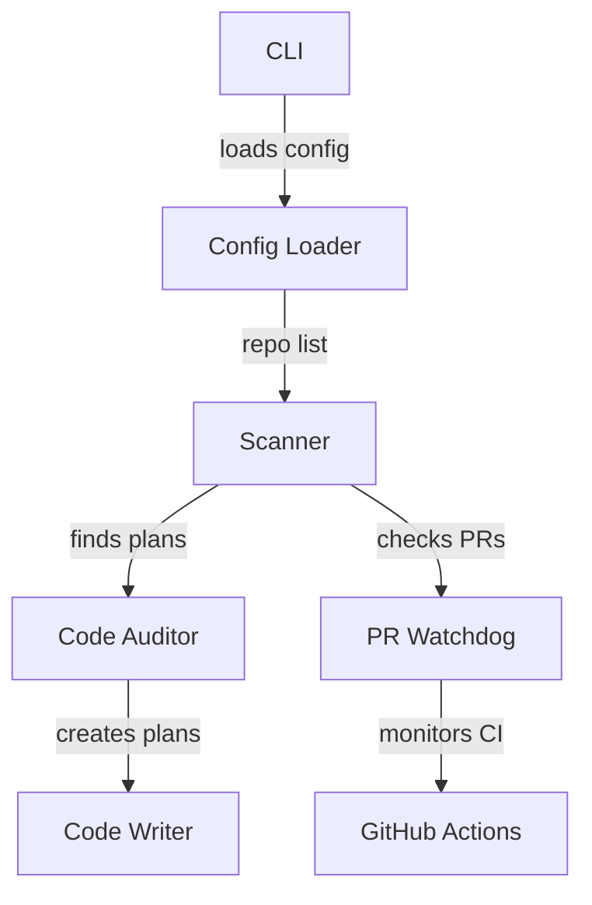

# Documentation Strategy

A two-tier documentation structure that separates **reference material** (what things are) from **how-to guides** (how to do things). Reference docs live at `docs/` top level; guides live in `docs/guides/`.

## Directory Layout

```
docs/
├── architecture.md          # System overview, component diagrams, tech stack
├── configuration.md         # Environment variables, config files, defaults
├── api.md                   # API endpoints, request/response examples (if applicable)
├── observability.md         # Health checks, metrics, logging, monitoring (if applicable)
└── guides/
    ├── project-structure.md # Repo layout, package conventions, dependency layers
    ├── coding-style.md      # Language standards, naming, formatting, linting
    ├── testing.md           # Test framework, fixtures, patterns, coverage
    ├── docker.md            # Container setup, images, compose, troubleshooting
    └── branching.md         # Git workflow, branch naming, PR process
```

Not every project needs every file. Include only what applies -- a CLI tool without an API skips `api.md`; a project without containers skips `docker.md`.

## When to Create docs/

Create a `docs/` directory when a project has enough complexity that README.md alone cannot cover it. Signals:

- More than one service or workspace package
- Non-trivial configuration (5+ env vars)
- Architecture worth diagramming
- Multiple contributors who need onboarding
- Docker, Kubernetes, or CI/CD setup

For simple single-file scripts or tiny CLIs, README.md is sufficient.

## Reference Docs (docs/*.md)

Reference docs describe **what things are**. They answer "what is this?" and "what does it look like?" A reader uses them to understand the system without doing anything.

### architecture.md

The most important doc. Start here when creating `docs/`.

Content:
- **System overview** with a Mermaid diagram showing how components connect
- **Component roles** table listing each major piece and its purpose
- **Data flow** diagram showing how information moves through the system
- **Technology stack** table mapping layers to tools
- **External services** with what data is sent/received

Use Mermaid for every diagram -- it renders natively on GitHub and most doc platforms. Prefer `graph TD` for architecture overviews and `flowchart LR` for data pipelines.

```markdown
## System Overview



## Component Roles

| Component | Purpose |
|-----------|---------|
| Scanner | Walks repos, finds plan files, extracts priorities |
| Auditor | Enforces coding standards via configurable rules |
| Watchdog | Polls PRs, reviews, approves, handles post-merge CI |
```

### configuration.md

Organize env vars into logical groups with tables. Include the variable name, default value, and purpose. This doc is the single source of truth for "what can I configure?"

```markdown
## Required

| Variable | Purpose | Example |
|----------|---------|---------|
| `API_KEY` | Service authentication | `sk-...` |

## Optional (with defaults)

### Database

| Variable | Default | Purpose |
|----------|---------|---------|
| `DB_HOST` | `localhost` | Database hostname |
| `DB_PORT` | `5432` | Database port |
```

### api.md

Only for projects with HTTP APIs. Document every endpoint with method, path, parameters, request body, and response examples. Group by resource or domain.

```markdown
### `POST /api/v1/submit`

Submit an item for processing.

**Request:** Multipart form data with `file` field.

```bash
curl -X POST http://localhost:8000/api/v1/submit -F "file=@item.txt"
```

**Response (200):**

```json
{"status": "submitted", "id": "abc-123"}
```

**Errors:**

| Code | Description |
|------|-------------|
| 400 | Invalid input |
| 500 | Internal error |
```

### observability.md

Health endpoints, metrics, logging configuration, and monitoring setup. Only for projects with infrastructure worth monitoring.

## How-To Guides (docs/guides/*.md)

Guides describe **how to do things**. They answer "how do I...?" A reader follows them to accomplish a specific task.

### project-structure.md

Explain the repo layout so new contributors know where things go. Include:

- Full directory tree with annotations
- Package/module layout conventions (e.g. `app/{name}/src/{name}/`)
- Dependency layers if it's a monorepo (which packages can import from which)
- How to add a new package/module
- Common commands table

### coding-style.md

Language-specific standards. Cover:

- Formatting rules (line length, indentation, quotes)
- Naming conventions table (variables, classes, constants)
- Type hint requirements
- Docstring format with example
- Comment guidelines ("explain why, not what")
- Error handling patterns
- Import ordering

### testing.md

How to write and run tests. Cover:

- Commands to run tests (single package, all, with coverage)
- Test file location convention
- Naming patterns for test functions
- Arrange-Act-Assert structure example
- Fixtures and how to use them
- Mocking guidance (what to mock, what not to)
- Parametrize examples for variant testing

### docker.md

Container setup for the project. Cover:

- Quick start commands (build, run, logs, stop)
- Image hierarchy if multi-stage
- Dockerfile conventions (base image, non-root user, healthcheck)
- Compose file layout and what each file contains
- Port assignments table
- Troubleshooting commands

### branching.md

Git workflow specific to the project. Cover:

- Branch diagram (ASCII or Mermaid)
- How to start work (checkout dev, create branch)
- Branch naming with type prefix table
- Staying current (rebase/merge from dev)
- PR creation process
- Post-merge cleanup
- Release and hotfix workflows

## Creating docs/ from Scratch

When scaffolding docs for a project that has none:

1. **Read the project first** -- scan README, AGENTS.md, config files, justfile, Dockerfile, and source to understand what exists
2. **Start with architecture.md** -- this forces you to understand the system and produces the most valuable doc
3. **Add configuration.md** -- extract env vars from `.env.example`, config files, or source code
4. **Add guides/** -- start with `project-structure.md` (repo layout) and `coding-style.md` (standards)
5. **Add remaining guides** as they apply -- testing, docker, branching
6. **Add api.md and observability.md** only if the project has APIs or monitoring

Every doc should be accurate to the project's current state. Skip sections where you have no real information rather than writing filler.

## Writing Standards

- Start each doc with an H1 title matching the filename purpose
- Use Mermaid diagrams for architecture, data flow, and component relationships
- Use tables for structured data (env vars, ports, commands, roles)
- Use code blocks with language tags for all commands and examples
- Keep commands copy-pasteable -- a reader should be able to paste and run
- Use relative links between docs (e.g. `[architecture](architecture.md)`)
- No timestamps or version numbers in docs -- they describe current state

## Maintaining docs/

Documentation rots when code changes but docs don't. When modifying a project:

- If you add a new env var, update `configuration.md`
- If you add a new endpoint, update `api.md`
- If you change the project structure, update `project-structure.md`
- If you change the tech stack, update `architecture.md`

The Doc Librarian recipe (if configured) audits documentation completeness automatically. For manual checks, verify:

- [ ] `docs/architecture.md` has at least one Mermaid diagram
- [ ] `docs/configuration.md` covers all env vars from `.env.example`
- [ ] `docs/guides/project-structure.md` matches actual directory layout
- [ ] All code examples in docs actually work
- [ ] No placeholder text (`TODO`, `...`, `{project-name}`)

## Relationship to Other Docs

| File | Location | Purpose | Audience |
|------|----------|---------|----------|
| `README.md` | Root | First impression, quick start, overview | Everyone |
| `CONTRIBUTING.md` | Root | Setup steps, PR workflow, commit conventions | Contributors |
| `AGENTS.md` | Root | Project context, commands, conventions for AI agents | AI agents |
| `docs/` | Directory | Deep reference and how-to guides | Developers |
| `skills/` | Directory | Machine-readable development instructions | AI agents |

README.md is the entry point that links to `docs/` for details. CONTRIBUTING.md covers the contributor workflow. `docs/` has the depth. They complement each other -- don't duplicate content across them.
