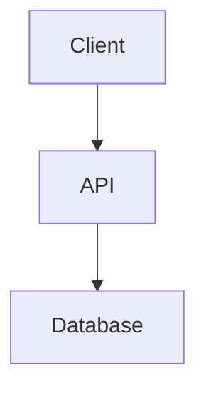

# Documentation Standards

Apply these documentation standards to ensure consistent, useful documentation across all projects.

## Required Files

Every repository must have these files:

### README.md

```markdown
# Project Name

Brief one-line description of what this project does.

## Overview

2-3 paragraphs explaining:
- What problem this solves
- Who uses it
- Key features

## Quick Start

\`\`\`bash
# Installation
uv sync

# Basic usage
project-name --help
\`\`\`

## Installation

Detailed installation instructions including:
- Prerequisites
- Step-by-step setup
- Environment variables needed

## Usage

Common use cases with examples.

## Configuration

| Variable | Description | Default |
|----------|-------------|---------|
| `API_KEY` | API authentication key | Required |
| `LOG_LEVEL` | Logging verbosity | `INFO` |

## Development

See [CONTRIBUTING.md](CONTRIBUTING.md) for development setup.

## License

[License type] - See [LICENSE](LICENSE) for details.
```

### CONTRIBUTING.md

```markdown
# Contributing to Project Name

## Development Setup

### Prerequisites
- Python 3.11+
- uv package manager

### Setup Steps
\`\`\`bash
git clone https://github.com/org/project-name
cd project-name
uv sync
just test
\`\`\`

## Code Style

- Follow project style guide
- Run `just lint` before committing
- Run `just format` to auto-format code

## Testing

- Write tests for new features
- Maintain >80% coverage
- Run `just test` to execute test suite

## Pull Request Process

1. Create a feature branch from `main`
2. Make your changes with tests
3. Run `just lint test`
4. Submit PR with clear description
5. Address review feedback

## Commit Messages

Follow conventional commits:
\`\`\`
type(scope): description

feat(auth): add OAuth2 support
fix(api): handle null response
docs(readme): update installation
\`\`\`

Types: `feat`, `fix`, `docs`, `style`, `refactor`, `test`, `chore`
```

### AGENTS.md (For AI-assisted repos)

```markdown
# AI Agent Instructions

## Project Context

This project is a [brief description]. Key things to know:
- Primary language: Python 3.11
- Framework: FastAPI
- Database: PostgreSQL

## Commands

Use the `justfile` for all standard operations:

\`\`\`bash
just test              # Run tests
just lint              # Lint code
just format            # Format code
just quality           # Full quality gate
\`\`\`

## Code Conventions

### Language-Specific Rules (adapt per project)

**Go:**
- Use `github.com/alecthomas/errors` for errors; never `fmt.Errorf()` or `errors.New()`
- Use `errors.Errorf("%w: message", err)` for wrapping
- Use `optional.Option[T]` for optional values, never pointers
- Use `github.com/alecthomas/assert/v2` for tests; `assert.Equal(t, expected, actual)`
- Never use `os.Getenv()` outside of `main()`

**React/TypeScript:**
- Functional components with hooks; no class components
- No `FC` or `React.FC`; use `export const MyComponent = ({ prop }: Props) => {`
- Use shadcn UI components (`<Button>`, `<Input>`) instead of raw HTML
- Import components directly from file path; no index.ts re-exports
- Run `just lint-fix-web` before committing

## Architecture

- [One-paragraph overview]
- [Key components and data flow]
- Use Mermaid diagrams for pipelines and architecture (see Doc Maintenance below)

## Common Tasks

### Adding a New Endpoint
1. Create route in `app/api/routes/`
2. Add service method in `app/services/`
3. Add tests in `tests/`

### Schema/Field Addition (data pipelines)
1. Update table schema in `metadata.yaml`
2. Update processing code (add to SCHEMA, extraction function, row mapping)
3. Update views if needed
4. Test changes

## Skills

Development guidance lives in `skills/`. Read the relevant SKILL.md before starting a task.

- `skills/terraform-project-structure/` -- Architecture, structure
- `skills/linting-standards/` -- Quality standards
- `skills/self-improvement/` -- Retros, lessons

## Files to Avoid Modifying

- `alembic/versions/` - Generated migrations
- `*.lock` - Lock files
- `.env*` - Environment files

## Landing the Plane (Session Completion)

**When ending a work session**, complete ALL steps. Work is NOT complete until `git push` succeeds.

1. **File issues** for remaining work
2. **Run quality gates** (if code changed)
3. **Update issue status**
4. **PUSH TO REMOTE** (MANDATORY):
   \`\`\`bash
   git pull --rebase
   git push
   git status  # MUST show "up to date with origin"
   \`\`\`
5. **Clean up** - Clear stashes, prune remote branches
6. **Hand off** - Provide context for next session

**IMPORTANT:** Always offer to push when work is complete. Don't leave commits sitting locally without asking.
```

## Downstream Consumer Safety (AGENTS.md section)

For libraries or packages consumed by other projects, add this section:

```markdown
## Downstream Consumer Safety

### Known Consumers

| Consumer | Location | Dependency | Usage Pattern |
|----------|----------|------------|---------------|
| tf-dart-metrics | `path/to/consumer` | `libname==version` | Subclasses `Rootly`, imports `get_attrib_info` |

### Public API Surface

Document classes, methods, and functions that constitute the contract. Changes require downstream impact check.

### Change Classification

**SAFE:** New methods, new optional params with defaults, internal refactoring, bug fixes.

**DANGEROUS:** Renaming/removing methods, changing return types, changing param names, moving functions.

**BREAKING:** Removing core methods, changing `__init__` signature, altering return structure.

### Before Making Changes Checklist

- [ ] Is this a public method/function? Check this rule.
- [ ] Does the change alter the signature? Ensure backwards compatibility.
- [ ] Does the change alter return types? Verify downstream still works.
- [ ] When in doubt, check consumer code to see how it's called.

### Safe Breaking Change Process

1. Add new version alongside old; deprecate old with warning
2. Coordinate with consumer maintainers
3. Update consumer after they've adapted
4. Remove old version only after all consumers have migrated
```

## Cursor Rules (.cursor/rules/)

Create a rule structure for AI agent guidance. Rules load in filename order.

### File Naming

Use `NNN-topic.mdc` where NNN is a 3-digit number controlling load order:

- `010` - Foundational
- `015` - Structure
- `020` - Workflow
- `030` - Planning
- `050` - Self-improvement
- `060` - Quality
- `062` - Formatting (language-specific)
- `070` - Debugging (language-specific)
- `080` - Retrospective
- `100` - Rule management

### Required Frontmatter

```yaml
---
title: Rule Title
description: One-line purpose
last_updated: YYYY-MM-DD
---
```

### Recommended Rule Files

| File | Purpose |
|------|---------|
| `010-core-principles.mdc` | Foundational values, mission |
| `015-project-structure.mdc` | Directory layout, key patterns |
| `020-workflow.mdc` | Quality gates, mandatory checks |
| `030-planning-execution.mdc` | Task flow, step-by-step guidance |
| `050-self-improvement.mdc` | Learning loop, retro protocol |
| `060-code-quality.mdc` | Quality philosophy |
| `062-format-{language}.mdc` | Language formatting (e.g. `062-format-python.mdc`) |
| `070-{language}-fixing.mdc` | Debugging patterns |
| `080-retro.mdc` | Retrospective protocol |
| `100-rule-management.mdc` | Rule evolution, update protocol |

### Skills Integration

Create `use-skills.mdc` to direct agents to project skills:

```yaml
---
description: Direct agent to use project skills for all guidance
alwaysApply: true
---
# Project Skills

This project uses skills in `skills/`. Before starting any task, check if a relevant skill exists and follow it.

Key skills:
- skill-name: Description
- another-skill: Description
```

### README in .cursor/rules/

Include a `README.md` in `.cursor/rules/` listing all rules:

```markdown
# Cursor Rules

| File | Purpose |
|------|---------|
| 010-core-principles.mdc | Foundational values |
| 015-project-structure.mdc | Project structure |
| ... | ... |

## Key Principles

- Quality-first: Run lint and tests before committing
- Self-improvement: Retro after tasks, propose rule updates when patterns emerge
```

## Skills Directory (skills/)

Organize project-specific AI guidance in a `skills/` directory at project root.

### Structure

```
skills/
├── skill-name/
│   └── SKILL.md
├── another-skill/
│   └── SKILL.md
└── ...
```

### SKILL.md Format

One `SKILL.md` per skill subdirectory. Use frontmatter: `name`, `description`, optional `globs`.

### Referencing Skills

- **From .cursor/rules/**: Use `use-skills.mdc` with `alwaysApply: true` to direct agents to read skills before tasks
- **From AGENTS.md**: List skills with descriptions; instruct agents to read relevant SKILL.md before starting
- **From CLAUDE.md**: Same as AGENTS.md for Claude-specific projects

### Example Skills Section (AGENTS.md)

```markdown
## Skills

Development guidance lives in `skills/`. Read the relevant SKILL.md before starting a task.

- `skills/terraform-project/` -- Architecture, YAML-to-TF patterns
- `skills/terraform-workflow/` -- Plan-first methodology
- `skills/code-formatting/` -- HCL, Python, YAML standards
- `skills/self-improvement/` -- Retros, lessons, skill evolution
```

## Doc Maintenance (from opal)

For docs in `docs/` or similar:

- **Start with a one-paragraph overview** of what the feature does and why it exists
- **Show the interface** (tool schema, function signature, config keys) before explaining internals
- **Use Mermaid diagrams** for pipelines, data flow, and architecture — not ASCII art
- **Include a "How it works" section** with enough detail to debug or extend; skip implementation trivia
- **End with a References section** linking to external sources, papers, benchmarks
- **No timestamps or version numbers** — docs describe current state, not changelog

### Mermaid Example



## Documentation Directory Structure

```
docs/
├── index.md                 # Documentation home
├── getting-started.md       # Quick start guide
├── installation.md         # Detailed installation
├── configuration.md         # Configuration reference
├── api/                     # API documentation
├── guides/                  # How-to guides
├── architecture/            # Technical architecture
└── development/             # Developer docs
```

## Markdown Standards

### Headers
```markdown
# Page Title (H1 - one per page)
## Major Section (H2)
### Subsection (H3)
```

### Code Blocks
Always specify language: ` ```python `, ` ```bash `, etc.

### Tables
```markdown
| Column 1 | Column 2 |
|----------|----------|
| Value 1  | Value 2  |
```

## API Documentation

```markdown
## GET /users/{id}

Retrieve a user by their unique identifier.

### Parameters

| Name | Type | In | Description |
|------|------|-----|-------------|
| `id` | integer | path | User's unique ID |

### Response

#### 200 OK
\`\`\`json
{"id": 123, "name": "John Doe"}
\`\`\`

#### 404 Not Found
\`\`\`json
{"error": "User not found"}
\`\`\`
```

## Verification Checklist

- [ ] README.md has Overview, Quick Start, Installation, Usage sections
- [ ] CONTRIBUTING.md has Setup, Code Style, Testing, PR Process sections
- [ ] AGENTS.md exists for AI-assisted projects
- [ ] Downstream Consumer Safety section if library has consumers
- [ ] .cursor/rules/ with README and numbered .mdc files if using Cursor
- [ ] skills/ directory with SKILL.md files if using skills
- [ ] Code blocks specify language
- [ ] Tables properly formatted
- [ ] All links valid
