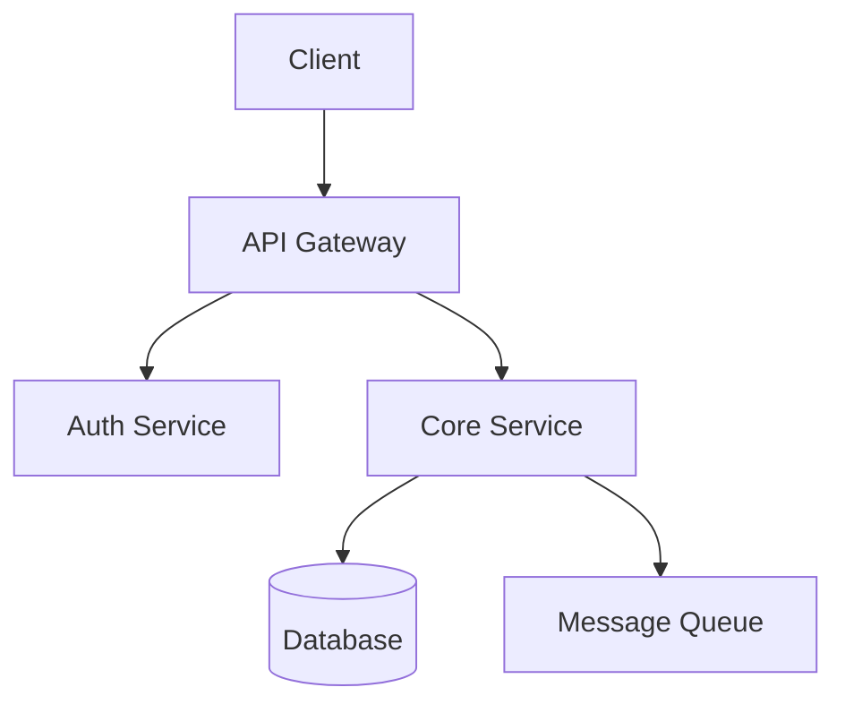

# README Blueprint Generator

Generate a thorough, accurate README.md by scanning the actual project -- its code, config files, directory structure, and existing documentation. The README reflects reality, not assumptions.

## Workflow

### Phase 1: Discover

Scan the project to understand what exists. Gather raw material from every available source before writing a single line. The more sources you read, the better the README.

#### Documentation files (read all that exist)

| File | What it tells you |
|------|-------------------|
| `AGENTS.md` / `CLAUDE.md` | Project context, commands, architecture, conventions |
| `CONTRIBUTING.md` | Setup steps, dev workflow, coding standards |
| `docs/` or `doc/` directory | Architecture, guides, API docs |
| `.github/copilot/` directory | Pre-analyzed architecture, tech stack, coding standards, folder structure |
| `copilot-instructions.md` | Project-specific AI instructions with context |
| Existing `README.md` | Current state (may be stale or incomplete) |
| `CHANGELOG.md` / `HISTORY.md` | Project maturity, recent changes |
| `LICENSE` | License type |

#### Config files (extract tech stack and tooling)

| File | What it tells you |
|------|-------------------|
| `pyproject.toml` | Python version, dependencies, dev tools, project metadata |
| `package.json` | Node/TS dependencies, scripts, project metadata |
| `go.mod` | Go module path, Go version, dependencies |
| `mix.exs` | Elixir deps, project name, version |
| `Cargo.toml` | Rust crate info, deps |
| `justfile` / `Makefile` | Available commands, dev workflow |
| `docker-compose.yml` / `Dockerfile` | Container setup, services |
| `noxfile.py` / `tox.ini` | CI session definitions |
| `.pre-commit-config*.yaml` | Quality gates |
| `terraform` / `*.tf` files | Infrastructure components |

#### Project structure

Run a directory listing to understand the layout. Note the top-level organization pattern:
- `src/` layout (Python, Rust)
- `app/` workspace members (uv monorepo)
- `cmd/` + `pkg/` (Go)
- `lib/` (Elixir, Ruby)
- `web/` or `frontend/` (frontend apps)

### Phase 2: Analyze

Before writing, synthesize what you found into answers for these questions:

1. **What is this project?** One sentence that explains the problem it solves.
2. **Who uses it?** End users, developers, internal teams, other services?
3. **What's the tech stack?** Languages, frameworks, databases, infrastructure.
4. **How do you get it running?** Prerequisites, install steps, env vars.
5. **How is it organized?** Key directories and their purposes.
6. **What does it do?** Core features and capabilities.
7. **How do you develop on it?** Dev workflow, commands, testing, linting.
8. **How do you contribute?** Standards, process, PR workflow.
9. **What's the license?** Open source? Proprietary? Internal?

If a `.github/copilot/` directory exists with pre-analyzed docs (Architecture, Technology_Stack, Coding_Standards, etc.), treat those as primary sources -- they contain curated, detailed analysis.

### Phase 3: Write

Generate the README using proper Markdown. Adapt sections based on what you actually found -- skip sections where you have no real information rather than writing vague filler.

#### Section order

```markdown
# Project Name

Brief description -- what it does and why it exists.

## Overview                    <!-- 2-3 paragraphs: problem, audience, key features -->

## Technology Stack            <!-- Languages, frameworks, databases, infra -->

## Architecture                <!-- High-level design, Mermaid diagram of components -->

## Getting Started
### Prerequisites              <!-- Runtime versions, system deps, accounts needed -->
### Installation               <!-- Step-by-step setup -->
### Configuration              <!-- Env vars, config files -->

## Project Structure           <!-- Key directories explained -->

## Development
### Commands                   <!-- justfile/make commands table -->
### Testing                    <!-- How to run tests, coverage, fixtures -->
### Linting & Formatting       <!-- Quality tools, how to run them -->

## Contributing                <!-- Link to CONTRIBUTING.md or summarize -->

## License                     <!-- License type, link to LICENSE file -->
```

#### Mermaid diagrams

Use Mermaid diagrams wherever they clarify relationships or flow. These render natively on GitHub and most documentation platforms.

- **Architecture section**: Include a component or flowchart diagram showing how major pieces connect (services, databases, queues, external APIs)
- **Data flow / pipelines**: Use `graph TD` or `flowchart LR` to show how data moves through the system
- **API service**: Show request flow through middleware, routers, services, and database layers
- **Monorepo**: Show package dependency graph between workspace members
- **CI/CD**: Show pipeline stages if the project has a non-trivial build/deploy process

```markdown
## Architecture


```

Skip diagrams only when the project is too simple to benefit (single script, tiny CLI tool). When in doubt, include one -- a diagram is worth a paragraph of prose.

#### Adaptation rules

- **Has `.github/copilot/` docs**: Use Architecture, Technology_Stack, Coding_Standards, Project_Folder_Structure, Unit_Tests, Workflow_Analysis, and Code_Exemplars files as primary sources. These contain detailed analysis -- extract and restructure rather than summarize.
- **Has `AGENTS.md`**: Pull architecture overview, commands table, and conventions from it.
- **Has justfile**: Extract commands into a table in the Development section.
- **Is a library/package**: Add a Usage section with import examples after Getting Started.
- **Is an API service**: Add an API Overview section with key endpoints.
- **Is a monorepo**: Add a Packages/Workspace Members section listing each member and its purpose.
- **Has CI/CD**: Mention the CI setup; add badges if you can determine the repo URL and CI provider.
- **Has Dockerfile**: Add a Docker section under Getting Started.

### Phase 4: Polish

After drafting, review for quality:

- Every claim is grounded in a file you actually read (no hallucinated features)
- Code blocks specify the language (` ```bash `, ` ```python `, etc.)
- Commands are copy-pasteable and correct
- Links to other files use relative paths (`[CONTRIBUTING](CONTRIBUTING.md)`)
- Tables are properly formatted
- No placeholder text like `TODO`, `...`, or `{project-name}` left behind
- Section headings follow a logical hierarchy (one H1, H2 for major sections, H3 for subsections)

## What Makes a Good README

A README succeeds when someone can go from "what is this?" to "I have it running locally" without asking anyone. Prioritize accuracy over completeness -- a shorter README with correct commands beats a comprehensive one with wrong setup steps.

The README should reflect the project's actual state, not its aspirations. If tests don't exist yet, don't write a Testing section. If there's no Docker setup, don't add one.

## Anti-Patterns

- **Hallucinated features**: Writing about capabilities the project doesn't have
- **Wrong commands**: Guessing at CLI commands instead of reading the justfile/Makefile
- **Stale tech stack**: Listing dependencies not in the actual config files
- **Generic filler**: "This project follows best practices" without specifics
- **Missing prerequisites**: Forgetting to mention required system tools (Docker, uv, Node, etc.)
- **Broken links**: Referencing files that don't exist

## Verification Checklist

- [ ] Scanned all available documentation files before writing
- [ ] Tech stack sourced from actual config files (pyproject.toml, package.json, etc.)
- [ ] All commands verified against justfile/Makefile
- [ ] Project structure matches actual directory listing
- [ ] Mermaid diagram included for architecture (unless project is trivially simple)
- [ ] No placeholder text remains
- [ ] Code blocks have language tags
- [ ] Links point to files that exist
- [ ] README is self-sufficient (reader can set up the project from it alone)
